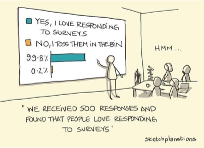

Machine learning (ML) has become an integral part of our lives, powering everything from recommendation systems to medical diagnoses. However, these powerful algorithms are not immune to bias, which can lead to unfair and discriminatory outcomes. One example of bias that recently made headlines is Gemini's recent <a href="https://www.theverge.com/2024/2/21/24079371/google-ai-gemini-generative-inaccurate-historical">release</a>.

This article delves into the different types of biases that can infiltrate machine learning models, explores their real-world consequences, and provides insights on how to mitigate them.

# Understanding Bias in Machine Learning
Bias in ML refers to systematic errors that arise from faulty assumptions or limitations in the training process. These errors can lead to models that unfairly discriminate against certain groups or perpetuate existing societal inequalities. We can broadly categorise these biases into three main groups:

<b>Data Bias</b>: This arises from biases present in the training data itself. If the data reflects historical or societal biases, the resulting model will likely inherit them.

<b>Algorithmic Bias</b>: This refers to systematic errors inherent in the algorithm's design or implementation, leading to biased outcomes even with unbiased data.

<b>Decision Scientist's Bias</b>: This stems from the subjective beliefs and assumptions of the people who build and deploy the models, potentially influencing the model's design and interpretation of results.

# Data Bias: The Roots of Unfairness
## Selection Bias
When the training data doesn't accurately represent the entire population, it leads to selection bias. This can manifest in various ways:
* <b>Sampling Bias</b>: The sample used to train the model doesn't reflect the diversity of the real world. For instance, conducting a political survey using landline phones is likely to capture more conservative views, as younger individuals, who are more likely to use mobile phones, would be underrepresented.

* <b>Non-response Bias</b>: Certain groups are less likely to respond to surveys or participate in data collection, skewing the data.

    

* <b>Attrition Bias</b>: Participants dropping out of a study non-randomly can lead to biased results. For example, in a clinical trial testing a weight loss drug, if 30% of participants in the treatment group drop out due to side effects while only 10% of the placebo group drop out, this would create attrition bias.

* <b>Survivor Bias</b>: Analyzing only successful cases and ignoring failures can lead to misleading conclusions (e.g., analyzing only profitable startups).

## Historical Bias (Latent Bias)

This arises when historical data used to train the model reflects past prejudices or inequalities. For example, if you create a model to predict the probability of someone winning the Nobel Prize, using the entire history of prize winners as training data, it would likely be biased towards males.

## Aggregation Bias
Combining data without considering inherent differences within groups can mask important variations (e.g., averaging salaries across job titles without accounting for experience levels).
## Measurement Bias
Flawed or inconsistent data collection methods can lead to inaccurate measurements (e.g., self-reported surveys on sensitive topics like drug use). This includes:

<b>Recall Bias</b>: Inaccurate or incomplete recall of past events. For example, individuals who perceive themselves as belonging to a marginalised group may be more likely to recall instances of discrimination, potentially overestimating its prevalence.

<b>Response Bias</b>: Tendency to answer questions inaccurately due to social pressure or other factors. For instance, in a survey on teenage mobile phone usage, respondents might underreport their screen time due to social desirability bias, fearing judgment for excessive use.

# Algorithmic Bias: When Algorithms Perpetuate Unfairness
## Association Bias
The algorithm learns to associate certain features with specific outcomes, even if those associations are not causal or are based on stereotypes (e.g., associating "nurse" with female and "doctor" with male).
## Interaction Bias
Biased user interactions with a system can reinforce and amplify existing biases (e.g., a chatbot trained on biased conversations). A real life example of this is <a href="https://www.theverge.com/2016/3/24/11297050/tay-microsoft-chatbot-racist">microsoft's chatbot</a>  back in 2016.
# Decision Scientist's Bias: The Human Element

## Confirmation Bias
The tendency to favour information that confirms pre-existing beliefs or hypotheses can lead to biased model design or interpretation of results. An excessive example of confirmation bias can be what Ronald H. Coase famously said "if you torture the data long enough, it will confess to anything".

# Mitigating Bias in Machine Learning
Addressing bias in ML requires a multi-faceted approach:
## Data Collection and Preprocessing
* Ensure diverse and representative training data.
* You can use <a href="https://pair-code.github.io/what-if-tool/">what-if</a>  tool from google, it is a great way to identify biases.

## Algorithm Selection and Design
* Choose algorithms that are less prone to bias like simple linear models
* Incorporate fairness constraints into the algorithm's objective function, such as those described <a href="https://developers.google.com/machine-learning/glossary/fairness">here</a> . For instance, if you have a <a href="https://www.datacamp.com/tutorial/the-cross-entropy-loss-function-in-machine-learning?utm_source=google&utm_medium=paid_search&utm_campaignid=21263768803&utm_adgroupid=167598735008&utm_device=c&utm_keyword=&utm_matchtype=&utm_network=g&utm_adpostion=&utm_creative=698229374533&utm_targetid=aud-517318242147:dsa-2218886984380&utm_loc_interest_ms=&utm_loc_physical_ms=9062542&utm_content=&utm_campaign=230119_1-sea~dsa~tofu_2-b2c_3-row-p1_4-prc_5-na_6-na_7-le_8-pdsh-go_9-na_10-na_11-na_bidding_p1_tofu_max_cc_vs_mcv_1.1-may24&gad_source=1&gclid=CjwKCAjwvIWzBhAlEiwAHHWgveRWHzcWJMdAhOSpCagWYDzuFrk8yHP2MfscnvMlt64upmAlUCZI3hoCILkQAvD_BwE">cross-entropy loss</a>  function  L, you can add a demographic parity <a href="https://developers.google.com/machine-learning/glossary/fairness#demographic-parityconstraint">demographic parity</a> DP to the loss function. The combined loss function can be represented as Lcombined=L+λ⋅DP, where λ is a hyperparameter that controls the trade-off between accuracy and fairness.

## Model Evaluation and Monitoring
* Regularly audit and monitor model performance for bias.
* Use diverse evaluation metrics to assess different aspects of fairness.

## Human Oversight
* Involve teams with diverse views in the development and deployment of ML systems.

# Conclusion
Bias in machine learning is a complex issue with far-reaching consequences. By understanding the different types of bias and their origins, we can develop strategies to mitigate them and create more equitable and trustworthy AI systems. The ongoing effort to address bias is not only a technical challenge but also a social imperative to ensure that technology serves everyone fairly.
