Feature engineering, plays a crucial role in machine learning algorithms. Feature engineering methods can be applied to numerical, categorical and textual data. Some of the key benefits of feature engineering are: 

1. Improved <a href="https://neptune.ai/blog/performance-metrics-in-machine-learning-complete-guide#:~:text=Performance%20metrics%20are%20a%20part,a%20metric%20to%20judge%20performance">performance</a>: by feature engineering, you can help the ML algorithm detect patterns easier. For example, in a model where you try to predict the prison sentence a guilty person given the committed crime - a good feature could be identifying adults (age > 17) since juveniles receive reduced sentences for the same crime;

2. Increase <a href="https://www.interpretable.ai/interpretability/what/#:~:text=What%20does%20it%20mean%20to,comprehend%20and%20trust%20the%20model">Model Interpretability</a>: by transforming the features or creating new features you can capture meaningful patterns and relationships in the data. This can support the understanding of the underlying data;

3. Handling categorical and textual data: majority of popular machine learning algorithms require numerical data, while in real life most features are categorical or textual data. Feature engineering can enables us to use such data;

4. Handling <a href="https://en.wikipedia.org/wiki/Nonlinear_system#:~:text=In%20mathematics%20and%20science%2C%20a,the%20change%20of%20the%20input.">non-linear</a> relationships: feature engineering can help capture non-linear relationships.


# Numerical features
## Discretization / Binning

Discretization is the method of dividing continuous numerical variables into discrete intervals or bins. This method is great to deal with non-linear relationships or <a href="https://en.wikipedia.org/wiki/Outlier">outliers</a>. An example of discretization is identifying a person's generation based on their age.

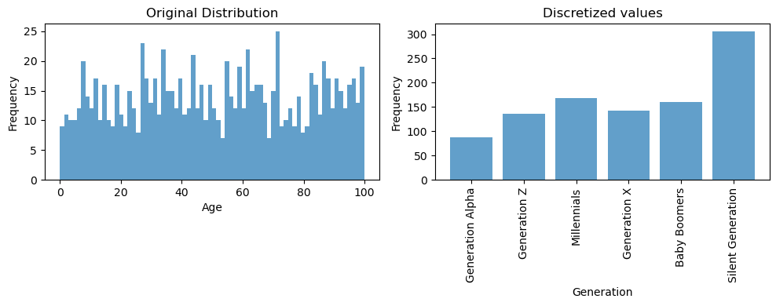

## Scaling and Normalization

Scaling and normalization methods ensure that numerical features are on a similar scale. This is extremely important when you are using one of the following algorithms: 

* **Gradient-descent based models**, because the optimization algorithm converges faster and prevents certain features to dominate due to differences to their scales

* **Distance based models**, because they are sensitive to scales. Scaling ensures each feature contributes proportionally and features with larger scales wouldn't dominate.

* **<a href="https://en.wikipedia.org/wiki/Regularization_(mathematics)">Regularized models</a>**, scaling makes sure all the features are regularized equally.
* **<a href="https://en.wikipedia.org/wiki/Support_vector_machine">Support Vector Machines</a>**, they are sensitive to feature scaling because they aim to identify the hyperplane which separates the classes and larger scale may dominate.
* **<a href="https://builtin.com/data-science/step-step-explanation-principal-component-analysis">Principal Component Analysis</a>** (PCA), scaling features is important because PCA aims to find the directions of maximum variance so having different scales would lead to have different variance even though proportionaly they are not.

<a href="https://www.analyticsvidhya.com/blog/2021/04/distinguish-between-tree-based-machine-learning-algorithms/">Tree-based</a> models are invariant to feature scaling.

Common methods for feature  scaling are:

* **Standardization (Z-Score normalization)**: Standardization is great to use when your data have outliers (you get a better quantification and detection of outliers). Z-score normalization is calculated by subtracting the mean from each data point and dividing by the standard deviation. It centers the data around zero and scales it based on standard deviation.	

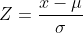
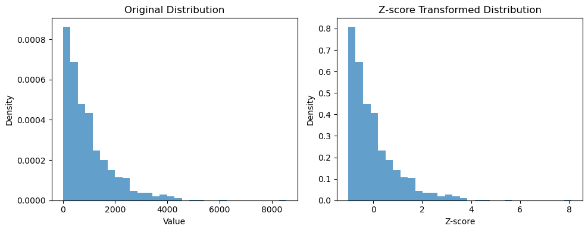

* **Min-max scaling**: Min-max scaling transforms linearly the data to a range [0, 1], it is great to use if you want to keep the data distribution but be careful because it is sensitive to outliers (outliers should be treated before applying min-max scaling). Min-max scaling is calculated by subtracting every data point (x) with the minimum value to shift the minimum value to 0, then divide the result by the range to scale the data within the desired range.

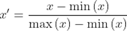
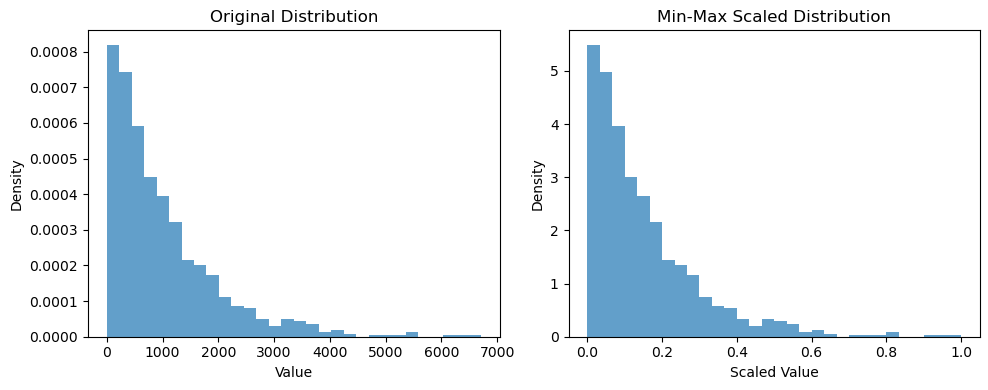

* **Max absolute scaling**: similar to min-max scaling transforms linearly the data to a range of [-1, 1]. Max absolute scaling is calculated by dividing every data point (x) with the maximum absolute value.


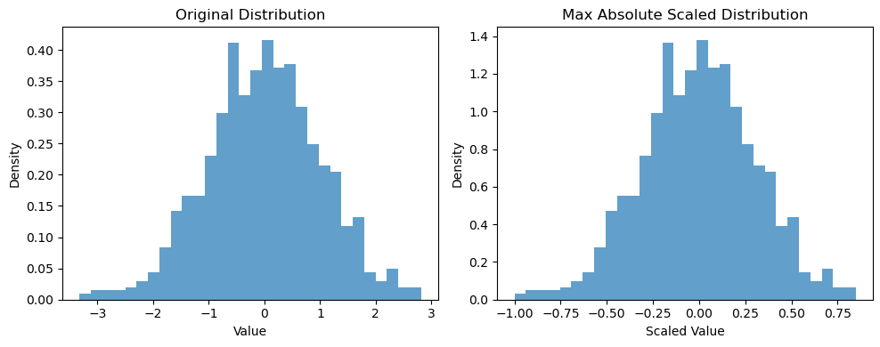

* **Robust scaling**: it is a good transformation method to deal with outliers. It subtracts every every data point with the <a href="https://en.wikipedia.org/wiki/Median">median</a> and divide it by the <a href="https://en.wikipedia.org/wiki/Interquartile_range">interquartile range</a>. 


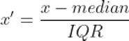
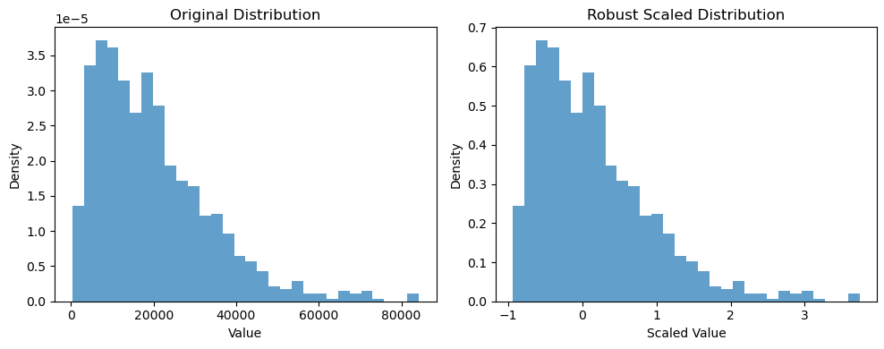


* **Power Transformation**: it is a family of transformations aim to normalize skewed data, handle heteroscedasticity, reduce outlier influence, linearize non-linear relationships. Examples of power transformations are: 

    * **Log transformation**: it is useful when data have outliers or when data have a right-skewed distribution, like the distribution at the left plot below.

    

    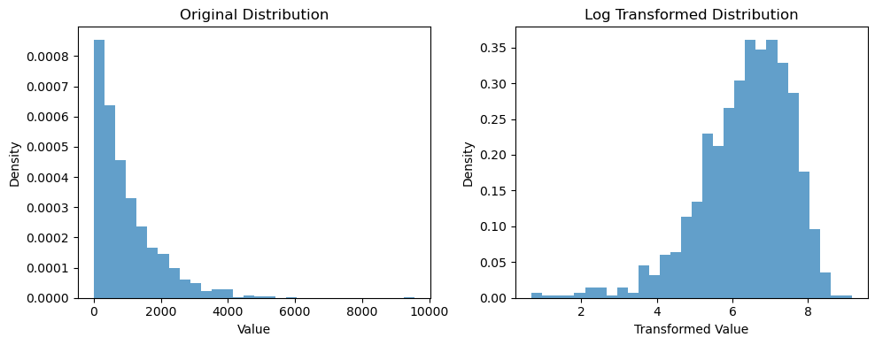

    * **Square Root Transformation**: can amplify smaller values making them more distinguishable, useful when data is left-skewed

    

    

    * **Box-Cox transformation**: good for normalizing data, lamda parameter needs to fine-tuned depending on the data
    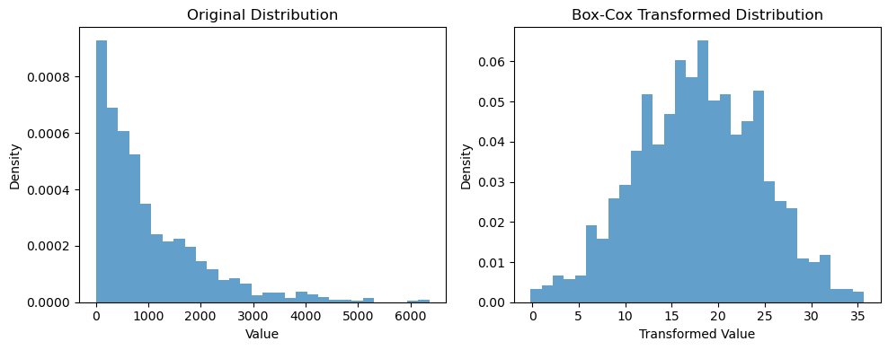

    * **Yeo-Johnson Transformation**: it is an extension of Box-Cox transformation that can handle negative values too

    

    * **Binary Scaling**: Also known as binarization, this technique converts numerical features into binary values based on a given threshold. At the example below we set the threshold to 18, it would be the processing we would have done to create a feature "is_adult" if we have the age of people.

    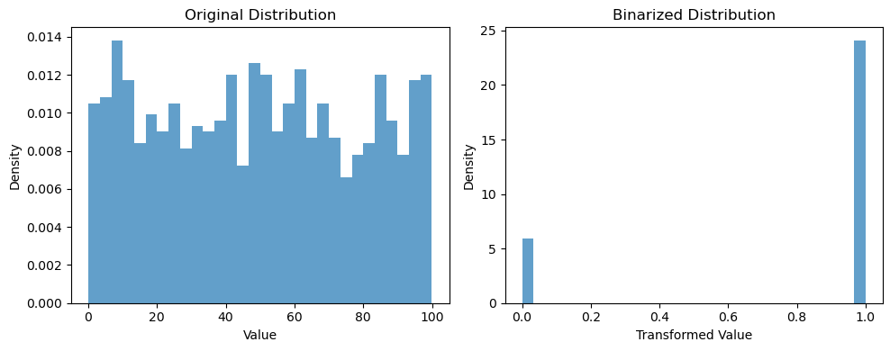

Feature scaling is a step that can greatly improve the performance of machine leaning models. However, it is important to note that not all machine learning models require feature scaling (like tree-based). It is important to scale the numerical features in a similar range, so that features with different ranges don't dominate the decision making just by their scale.

# Feature encoding

Feature encoding is the process of transforming categorical or textual data to numerical representations so that they can be utilized by machine learning algorithms. We will go through the most common feature encoding methodologies.

## Categorical data

* **One-hot encoding**: each category in the categorical feature is transformed into a binary vector. It is the simplest feature encoding methodology but the representation can be very sparse and cause <a href="https://en.wikipedia.org/wiki/Curse_of_dimensionality">curse of dimensionality</a> issue if the categorical feature has too many categories.

<div style="text-align:center">
    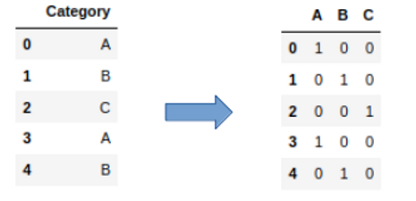
</div>


* **Label encoding**: each category is mapped to an integer. This method is very useful if order matters, but it can cause problems if the order is not right since it would require a bit of more data to identify non-linear patterns.

<div style="text-align:center">
    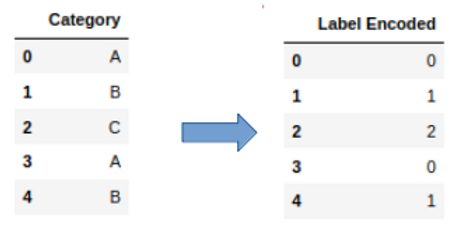
</div>

* **Ordinal encoding**: similar to label encoding, but in this transformation you need to set a priori which is the right order. For example you can use it to represent education level.

<div style="text-align:center">
    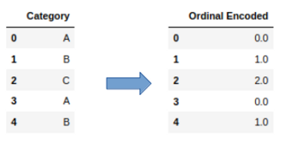
</div>

* **Count Encoding**: it replaces the category with the number of occurrences of the category in the dataset. This encoding captures the frequency of the categories and can be used for features with high-cardinality. It is important to note that this encoding methodology can introduce many errors if it is applied blindly. Look at the example below, it treats "Category" "A" and "B" the same due to their frequency.

<div style="text-align:center">
    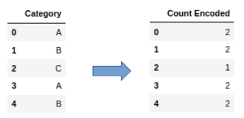
</div>

* **Hashing Encoding**: applied a <a href="https://en.wikipedia.org/wiki/Hash_function">hash function</a> to the categorical feature(s) and transform the categories into a number or bins, something interesting about this method is that it can be applied in multiple features at a time. It is a great method to reduce the dimensionality when you try to encode a feature with high-cardinality. The example below it shows how hash encoding would map two categorical variables into 5 binary features.

<div style="text-align:center">
    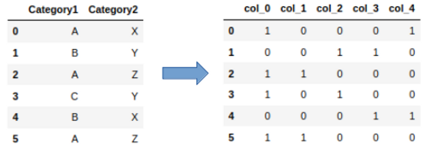
</div>

* **Target Encoding**: It replaces the category with the average target value of the corresponding category. This encoding method can be misleading if the <a href="https://en.wikipedia.org/wiki/Training,_validation,_and_test_data_sets">training set</a> is not very representative of the serve set.

<div style="text-align:center">
    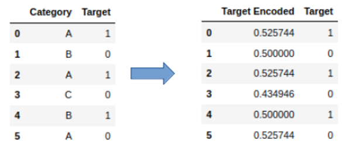
</div>


## Textual data
There are multiple  methods to transform text data into numerical representation. We will go from the simplest to the most complex methods. It is important to note that we don't go through all the methods, because this is an active area of research and there is tons of methods that someone could use.

* **Bag-of-words (BOW)**: BOW represents every document as a vector where the elements represent the unique words of the <a href="https://www.merriam-webster.com/dictionary/corpus#:~:text=%3A%20the%20body%20of%20a%20human,distinct%20from%20income%20or%20interest">corpus</a>. The values of the vector element reflect the frequency of the words found in the given document.

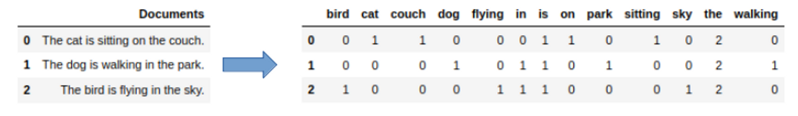

* **Term Frequency-Inverse Document Frequency (TF-IDF)**: it calculates the importance of every word in a given document within a corpus. It considers both the word (term) frequency (TF) and the scarcity of the word across the corpus (IDF).

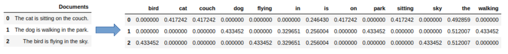

* **N-gram representation**: N-grams representation measures the co-occurrence of words or characters in a text. N-gram is a sequence of words or characters and it is used to capture the context of the words or characters in the text. In the example below we will illustrate how an n-gram representation can look like for n=2 and n=3.

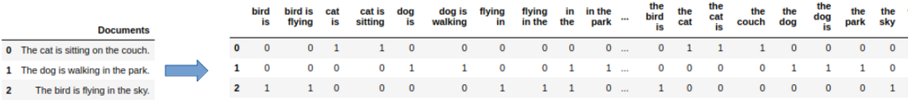

* **Word Embeddings**: they represent words as a dense vector in a continuous vector space. An extension to word embeddings can be <a href="https://en.wikipedia.org/wiki/Sentence_embedding#:~:text=Sentence%20embedding%20is%20the%20collective,to%20vectors%20of%20real%20numbers">sentence embeddings</a> and <a href="https://arxiv.org/pdf/1707.02377.pdf">document embeddings</a>. Text embeddings are the most advanced method (so far) for numerically representing text. They are great to represent the semantics of words, which means that similar words should be nearby in the vector space. A well-trained word embedding model should map words to vector space the following way: 

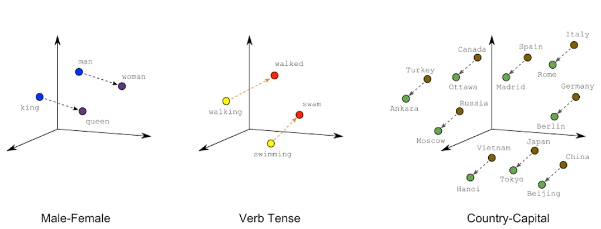


If you are interested in investigating text representation further, you could examine character-level representation (where you encode the characters as one-hot encoded) and Subword-level representation.

# Python implementation

In this section we will go through a practical example illustrating how feature transformations can be applied and how can they impact the performance of our model. We will use the data trying to identify credit card fraud and can be downloaded from <a href="https://www.kaggle.com/datasets/mlg-ulb/creditcardfraud?resource=download">here</a>.

We will start by importing the required modules:

```python
import pandas as pd
from scipy import stats
from sklearn.model_selection import train_test_split
from sklearn.metrics import f1_score, precision_score, recall_score
from sklearn.linear_model import LogisticRegression
```
The next step is to download the data and keep the features we think are useful:

```python
# Load the dataset
url = "https://archive.ics.uci.edu/ml/machine-learning-databases/adult/adult.data"
column_names = ["age", "workclass", "education", "sex", "race", "occupation","hours-per-week", "income"]
data = pd.read_csv(url, header=None, names=column_names)
data = data[column_names]
```
Let's write some functions to help us evaluate the transformations faster:

```python
def set_train_test(data):

    # Split the dataset into features and target variable
    X = data.drop('income', axis=1)  # Features
    y = data['income']  # Target variable

    # Split the dataset into training and testing subsets
    return train_test_split(X, y, test_size=0.2, random_state=42)

def evaluate_solution(data):
    
    train_x, test_x, train_y, test_y = set_train_test(data)
    
    model = LogisticRegression()
    model.fit(train_x, train_y)
    probs = model.predict_proba(test_x)

    # Predict on the test set
    custom_threshold = 0.3

    # Adjust the predicted labels based on the threshold
    y_pred = (probs[:, 1] >= custom_threshold).astype(int)

    # Calculate evaluation metrics
    f1 = f1_score(test_y, y_pred)
    precision = precision_score(test_y, y_pred)
    recall = recall_score(test_y, y_pred)

    # Print the evaluation metrics
    print("F1 score:", f1)
    print("Precision:", precision)
    print("Recall:", recall)
```

Having the data loaded, let's have a high-level look of them to see what transformations can we apply.

```python
data.info()
```
<div style="text-align:center">
    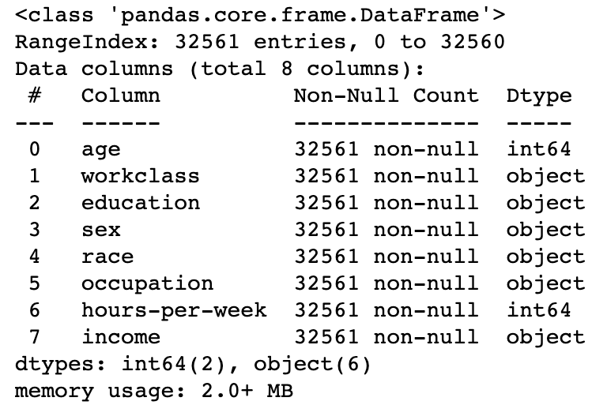
</div>

We can see we have only two numeric variables and the rest are categorical. 

For the first experiment we will transform the categorical variables using one-hot encoding to form a baseline solution.

```python
one_hot = ["workclass", "education", "race", "occupation", "sex"]
# apply one-hot encoding in categorical variables
one_hot_data = pd.get_dummies(data[one_hot], prefix=one_hot)
encoded_data = pd.concat([data, one_hot_data], axis=1).drop(one_hot, axis=1)
evaluate_solution(encoded_data)
```

<div style="text-align:center">
    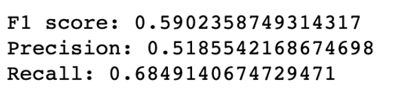
</div>


Let's conduct a transformation to the numeric variables and see if we can achieve better results.

```python
scale_negative = ["age", "hours-per-week"]
for s in scale_negative:
    scaled_data, _ = stats.yeojohnson(data[s].values)
    encoded_data[s] = pd.Series(scaled_data.flatten())
    
evaluate_solution(encoded_data)
```
<div style="text-align:center">
    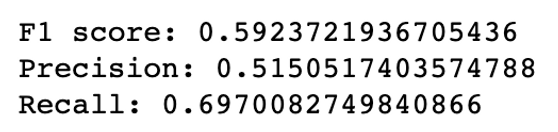
</div>

It turns out there are some benefits from scaling our data, it turns out Recall is getting a slight improvement.

Finally, let's conduct another transformation to the categorical data and let's encode one of the features as ordinal.

```python
# ordinal encoding
mapping_encoding = {' Preschool': 0,
                     ' 1st-4th': 1,
                     ' 5th-6th': 2,
                     ' 7th-8th': 3,
                     ' 9th': 4,
                     ' 10th': 5,
                     ' 11th': 6,
                     ' 12th': 7,
                     ' HS-grad': 8,
                     ' Prof-school': 9,
                     ' Assoc-acdm': 10,
                     ' Assoc-voc': 11,
                     ' Some-college': 12,
                     ' Bachelors': 13,
                     ' Masters': 14,
                     ' Doctorate': 15}

one_hot_ordinal = ["workclass", "race", "occupation", "sex"]


one_hot_data = pd.get_dummies(data[one_hot_ordinal], prefix=one_hot_ordinal)
encoded_data_ordinal = pd.concat([data, one_hot_data], axis=1).drop(one_hot_ordinal, axis=1)

for s in scale_negative:
    scaled_data, _ = stats.yeojohnson(encoded_data_ordinal[s].values)
    encoded_data_ordinal[s] = pd.Series(scaled_data.flatten())
    
encoded_data_ordinal["education"] = encoded_data_ordinal["education"].map(mapping_encoding)

evaluate_solution(encoded_data_ordinal)
```
<div style="text-align:center">
    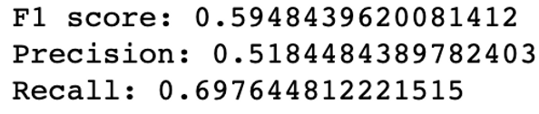
</div>

You should note, that the examples above are used to illustrate the impact and implementation of transformations you should not apply the transformations and evaluate performance so naively. After applying the transformations in a normal setting, you should do <a href="https://machinelearningmastery.com/feature-selection-with-real-and-categorical-data/#:~:text=Feature%20selection%20is%20the%20process,the%20performance%20of%20the%20model">feature selection</a>, <a href="https://cloud.google.com/ai-platform/training/docs/hyperparameter-tuning-overview#:~:text=Hyperparameter%20tuning%20takes%20advantage%20of,maximizes%20your%20model's%20predictive%20accuracy">hyperparameter tuning</a>, <a href="https://www.iguazio.com/glossary/classification-threshold/#:~:text=The%20most%20common%20method%20for,TN)%20at%20all%20classification%20thresholds">threshold selection</a>, <a href="https://en.wikipedia.org/wiki/Model_selection">model selection</a>, <a href="https://www.investopedia.com/terms/s/sensitivityanalysis.asp#:~:text=Sensitivity%20analysis%20is%20a%20financial,a%20certain%20range%20of%20variables.">sensitivity analysis</a> before concluding to the best model. Another note, transformations can be tricky, when you apply them in a new serve set you should not do "fit_transform" method but you should apply the "transform" method (using <a href="https://scikit-learn.org/stable/">sklearn</a> lingo here, similar methods are in other modules which conduct data transformations), a nice article illustrating the difference can be found <a href="https://towardsdatascience.com/what-and-why-behind-fit-transform-vs-transform-in-scikit-learn-78f915cf96fe">here</a>.


# Conclusion

In summary, data transformation plays a crucial role in optimizing model performance by addressing issues related to data representation, scaling, and distribution. Moreover, data transformation enable us to utilize categorical and textual data in our machine learning model. By utilizing appropriate data transformation techniques tailored to the specific characteristics of the dataset, we can enhance the effectiveness and reliability of our machine learning models, ultimately driving better insights and decision-making in various domains.

