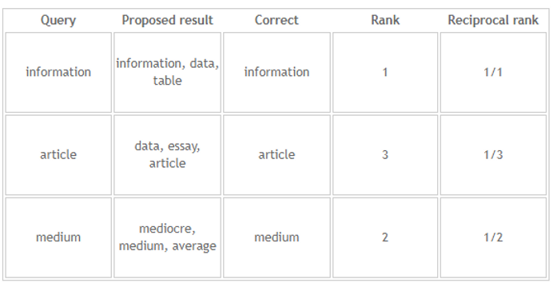
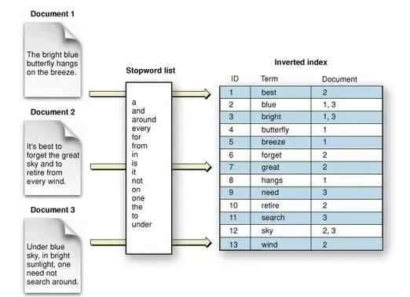

"Information retrieval is a field concerned with the structure, analysis, organisation, storage, searching, and retrieval of information" (Gerard Salton). Information retrieval has many use cases, namely <a href="https://www.techtarget.com/whatis/definition/search-engine">search engines</a>, <a href="https://www.techtarget.com/searchcustomerexperience/definition/chatbot">chatbots</a>, <a href="https://towardsdatascience.com/recommendation-systems-a-review-d4592b6caf4b">recommender systems</a>, documents summarisation and more. The most popular use case is search engine, where the user writes a query and receives as an answer a list of documents ranked by relevance. In this blog, we will go through the components of information retrieval, the metrics that can be used to measure the performance of the information retrieval program and finally we will go through a python implementation and a real life example. Prior to writing this blog, I have read and was heavily influenced by <a href="https://nlp.stanford.edu/IR-book/pdf/irbookonlinereading.pdf">An Introduction to Information Retrieval</a> and  <a href="https://ciir.cs.umass.edu/downloads/SEIRiP.pdf">Search engines</a>, Information Retrieval in Practice, many of the definitions come directly from the former book. They are both great books and I would suggest the reader to look into them to get a deeper understanding of the topic of information retrieval. 

# Information retrieval components
The information retrieval programs consist of two components. The first component is the indexing system, where the program stores the data in an efficient way so that it can retrieve the documents quickly. The second component is the query system where it uses the user's query and retrieves the documents that are the most relevant according to the query (Mario Pérez-Montoro, Lluís Codina, in Navigation Design and SEO for Content-Intensive Websites). 


Some applications of information retrieval have other components too, like search engines have crawlers. A crawler parses the web and stores the webpages to the indexing system of the search engine. It is an extremely complicated task and it is a vital component for a good search engine. The complexity of every component varies depending on the use case, for example in a search engine, the crawler (arguably) could be the most complex task while in a information retrieval program for legal documents, indexing system can be the most challenging task.

## Indexing system

The information retrieval system needs to store the documents efficiently in terms of computational time and memory. Indexing system is the component for storing the documents for the information retrieval system, it should not store the whole document, but an identifier of the document like an ID, document title, file name, etc.  The indexing system should also store information that can be used by the ranking algorithm utilised by the query system, for example number of key words or length of document or something the ranking algorithm deems relevant.


In order for the indexer to be more meaningful, some pre-processing is required. Usually the pre-processing steps are:

* **Tokenisation**: task of chopping the documents up into pieces called tokens.

* **Dropping stop words**: task of removing extremely common words with little meaning like "the", "a", etc.

* **Normalisation**: the process of canonicalising tokens so that matches occur despite superficial differences in the character sequences of the tokens. An example of such a process is "USA" and "U.S.A", you would like those two tokens to treat them the same. More concretely, normalisation has the following processes

  * **remove accents and diacritics**: we would like to treat naive and naïve the same way

  * **case-folding or capitalisation**: turn all characters to lower or upper case. 

* **Stemming and lemmatisation**: remove inflectional and derivationally related forms of a word to a base form word.

  * **Stemming**: refers to a crude heuristic process that chops off the ends of words in the hope of achieving this goal correctly most of the time, and often includes the removal of derivational affixes.

  * **Lemmatisation**: refers to doing things properly with the use of a vocabulary and morphological analysis of words, normally aiming to remove inflectional endings only and to return the base or dictionary form of a word, which is known as the lemma.

The indexing system should be updated in a regular basis, because it is important for the information user to have the most updated information available. Imagine writing a query in google search about <a href="https://chat.openai.com/">ChatGPT</a>, but the webpage is not indexed yet, so you would not get the result of the query. You should not be a satisfied search engine user if that would have been the case.


## Query system

The second component of the information retrieval system is the query system, where the user writes a query for his information need and the system returns the most relevant documents ordered by a ranking algorithm. The query system can be decomposed into three components:

* **query analysis**: aims to understand what is the information need of the user, multiple methods can be used to do that like splitting the query into keywords and then trying to find them, utilizing text embeddings and many more.

* **document retrieval**: looks into the indexing system and finds the best matches.

* **display of the documents**: display the most relevant documents, which are ordered by relevance using a ranking algorithm.


# Evaluation metrics

## Mean reciprocal rank
<a href="https://en.wikipedia.org/wiki/Mean_reciprocal_rank">Mean reciprocal rank</a> is one of the most popular performance metrics for information retrieval tasks. It aims to calculate the relevance of query responses. Reciprocal rank is the inverse of the responses' correct answer rank. The mean reciprocal rank is the average of the reciprocal ranks of all queries used to evaluate our model.

### Example

Let's explore some examples to understand better how reciprocal rank is calculated.



The mean reciprocal rank of the queries above is: (1 + 1/3 + 1/2) /3 = 0.61.

## Mean average precision
It is a metric to calculate the precision of the information retrieval system over a number of queries for the given top k results the query to return. Precision is calculated as the ratio of true_positives/positives, average precision is the average of the incremental precision metric for the top k results. The mean average precision is the average of the average precision over all the queries used at the evaluation set. A very good article to understand the mean average precision is <a href="https://towardsdatascience.com/breaking-down-mean-average-precision-map-ae462f623a52">this</a>.

### Example

Let's use the previous example to get a better understanding, let's assume we return the top 3 results. The average precision would be: average precision = (P@1 + P@2 + P@3)  / 3. P@k stands for the precision at the top k results.
For the queries the average precision is: 


* Query 1: P@1 = 1, P@2 = 0.5, P@3 = 0.33 because we found the query at the first result. So the average precision for the first query is (1 + 0.5 + 0.33) / 3 = 0.61

* Query 2: P@1 = 0, P@2 = 0, P@3 = 0.33 because we found the query at the third result. So the average precision for the second query is (0 + 0 + 0.33) / 3 = 0.11

* Query 3: P@1 = 0, P@2 = 0.5, P@3 = 0.33 because we found the query at the first result. So the average precision for the third query is (0 + 0 .5+ 0.33) / 3 = 0.277


The mean average precision for the information retrieval system for the three examples is (0.61 + 0.11 + 0.277) / 3 = 0.33
Information retrieval implementation
In this section, I illustrate how can we implement the concepts above in python, and then I will illustrate a use case to implement logging parsing in an efficient way.
For the indexing system we will use an inverted index, a conjunctive search as querying system and sorting in descending order by term frequency as ranking algorithm.

# Information retrieval implementation

In this section, I illustrate how can we implement the concepts above in python, and then I will illustrate a use case to implement logging parsing in an efficient way.
For the indexing system we will use an inverted index, a conjunctive search as querying system and sorting in descending order by term frequency as ranking algorithm.

## Text pre-processing
In this scenario we follow all the pre-processing steps mentioned before.


The **first** preprocessing step we do is cleaning the words from symbols and whites paces:
```python
text = text.replace("\n", " ")
text = text.strip()
text = re.sub(r'[^\w]', ' ', text)
```

The **second** preprocessing step is normalizing the text and having all characters as lower case (case-folding): 

```python
text = text.lower()
```
The **third** step is creating word tokens from the text:

```python
word_tokens=word_tokenize(text)
```
The **fourth** step is to remove the stop words:

```python
stop_words = set(stopwords.words('english'))
filtered_word_tokens = [
    w for w in word_tokens if w not in stop_words]
```
The **fifth** step is to retrieve the stem from the words, for this scenario we use the *Porter stemmer* but there are many more stemmers you can choose from
<a href="https://www.nltk.org/api/nltk.stem.html">here</a>.

```python
ps = PorterStemmer()
stemming = []

for w in filtered_word_tokens:
  stem = ps.stem(w)
  stemming.append(stem)
```

The **last** step is to retrieve the lemma from the words, for this example we use the *Wordnet lemmatizer*:

```python
wordnet_lemmatizer = WordNetLemmatizer()

lemmatization = []
for w in stemming:
  lemma = wordnet_lemmatizer.lemmatize(w)
  lemmatization.append(lemma)
```
Let's wrap up the  steps above and create a function which takes as input a piece of text and returns a list of clean words ready to be processed by the indexer or the retriever.


```python
def preprocess_doc(text: str) -> list:

    # clean text
    text = text.replace("\n", " ")
    text = text.strip()
    text = re.sub(r'[^\w]', ' ', text)

    # normalisation, case-folding
    text = text.lower()

    # tokenise
    word_tokens = word_tokenize(text)

    # remove stop words
    stop_words = set(stopwords.words('english'))
    filtered_word_tokens = [
        w for w in word_tokens if w not in stop_words]

    # retrieve stem from words
    ps = PorterStemmer()
    stemming = []

    for w in filtered_word_tokens:
        stem = ps.stem(w)
        stemming.append(stem)

    # retrieve lemma from words
    wordnet_lemmatizer = WordNetLemmatizer()

    lemmatization = []
    for w in stemming:
        lemma = wordnet_lemmatizer.lemmatize(w)
        lemmatization.append(lemma)

    return lemmatization
```

## Indexing system

In this implementation we use the <a href="https://www.geeksforgeeks.org/inverted-index/">inverted index</a> as indexing system. The inverted index is a <a href="https://en.wikipedia.org/wiki/Hash_table">hash map</a> data structure with key being the term we index and value is a list of documents (also known as <a href="https://nlp.stanford.edu/IR-book/html/htmledition/the-term-vocabulary-and-postings-lists-1.html">posting lists</a>) where the term has appeared. See below:



(https://www.linkedin.com/pulse/what-inverted-index-saral-saxena/?trk=related_artice_What%20is%20inverted%20index%3F_article-card_title)


As mentioned before, in the indexing system we may store more data other than text related which can be helpful for the query system. In our case, we store the frequency of the terms in the stored document so that can be used by the ranking algorithm at the query system.


The inverted index implementation can be found below:

```python
def create_inverted_index(
        documents: dict,
        inverted_index: dict) -> dict:

    for id, doc in documents.items():

        doc = preprocess_doc(doc)

        for w in doc:
            if w in inverted_index:
                if id in inverted_index[w]:
                    inverted_index[w][id] += 1
                else:
                    inverted_index[w][id] = 1
            else:
                inverted_index[w] = {id: 1}

    return inverted_index
```

The inverted index takes as input two dictionaries, the first dictionary contains the documents we want to index where the key is the document ID and the value of the dictionary is the content of the document. The second dictionary of the function is the inverted index we have calculated already, in case we run the inverted index for the first time we should feed an empty dictionary.  The function returns the modified inverted index containing the information from the input documents.

We will sort the inverted index by document ID, because it is a requirement for the query system algorithm the posting list to be sorted without duplicates.

```python
def create_sorted_inverted_index(documents: dict) -> dict:

    inverted_index = create_inverted_index(documents, dict())
    sort_inverted_index = dict()
    for i in inverted_index.keys():
        sort_inverted_index[i] = sorted(
            inverted_index[i].items(),
            key=lambda x: x[1], reverse=True)

    return sort_inverted_index
```

## Query system

For the query system, we want to use conjunctive search which essentially means that all terms (except from stop words) of the query terms need to be present in the document in order to be returned. Moreover, we sort the returned documents by the frequency of the terms present in the documents. We would like to represent the posting lists with the following structure (document id, term frequency), an example of a posting list can be: [('Doc 8', 1), ('Doc 7', 1), ('Doc 4', 1), ('Doc 2', 1), ('Doc 1', 1)]

We will use an efficient way to find the common elements of the posting lists among terms using the following algorithm and we sum the frequencies of the terms for the common documents:

```python
def intersect_posting(ii1: list, ii2: list):

    a1 = [x[0] for x in ii1]
    a2 = [x[0] for x in ii2]
    answers = []
    i = 0
    j = 0
    while i < len(a1) and j < len(a2):
        if a1[i] == a2[j]:
            answers.append((a1[i], sum([ii1[i][1], ii2[j][1]])))
            i += 1
            j += 1
        elif a1[i] < a2[j]:
            i += 1
        else:
            j += 1
    return answers
```

If you choose not to take into account the frequencies of the terms, the algorithm should only take into account the common elements of the lists.

The algorithm above takes into account only the scenarios that the query has two terms. Now let's see how can we process queries with more than two terms:

```python
def intersect(query: str, sort_inverted_index: dict) -> list:

    query_list = preprocess_doc(query)
    terms = sort_frequency(sort_inverted_index, query_list)
    first_term = terms[0]
    result = sort_inverted_index[first_term]
    # rest of terms
    terms = rest(terms)
    while len(terms) > 0 and len(terms) > 0:
        first_term = terms[0]
        terms = rest(terms)
        result = intersect_posting(result,
                                   sort_inverted_index[first_term])
    result.sort(key = lambda x: x[1], reverse=True)
    return result
```

At the algorithm above, we have a number of high level functions in order to simplify the code. The function *sort_frequency* sorts the query terms by the frequency they appear in the documents in ascending order. The function *rest* function removes the first element of the term list that is fed into the input.

Please find below all the functions in order to run a conjunctive search. 

```python
def intersect_posting(ii1: list, ii2: list):

    a1 = [x[0] for x in ii1]
    a2 = [x[0] for x in ii2]
    answers = []
    i = 0
    j = 0
    while i < len(a1) and j < len(a2):
        if a1[i] == a2[j]:
            answers.append((a1[i], sum([ii1[i][1], ii2[j][1]])))
            i += 1
            j += 1
        elif a1[i] < a2[j]:
            i += 1
        else:
            j += 1
    return answers


def sort_frequency(inverted_index: dict, query_list: list):

    term_freq = dict()
    for q in query_list:
        doc_list = inverted_index.get(q, (None, 0))
        term_freq[q] = sum([x[1] for x in doc_list])
    sorted_terms = sorted(term_freq.items(), key=lambda x: x[1])
    sorted_terms = [x[0] for x in sorted_terms]
    return sorted_terms


def rest(terms: list):

    try:
        terms = terms[1:]
    except BaseException:
        terms = None
    return terms


def intersect(query: str, sort_inverted_index: dict) -> list:

    query_list = preprocess_doc(query)
    terms = sort_frequency(sort_inverted_index, query_list)
    first_term = terms[0]
    result = sort_inverted_index[first_term]
    # rest of terms
    terms = rest(terms)
    while len(terms) > 0 and len(terms) > 0:
        first_term = terms[0]
        terms = rest(terms)
        result = intersect_posting(result,
                                   sort_inverted_index[first_term])
    result.sort(key = lambda x: x[1], reverse=True)
    return result
```

## Evaluation

The first evaluation metric that will be used is *mean reciprocal rank* where we assume that only one document is correct for our query.

```python
def mean_reciprocal_rank(df: pd.DataFrame) -> float:

    df["reciprocal_rank"] = df["IsRelevant"] / df["rank"]

    mean_rr = df.groupby(["Query"])["reciprocal_rank"].max().mean()

    return mean_rr
```
The second evaluation metric which will be utilized is *mean average precision* which is a good metric to be used when there are more than one documents which satisfy the information need.


```python
def mean_average_precision(df: pd.DataFrame) -> float:

    for q in df["Query"].unique():
        ranks = sorted(df[df["Query"] == q]["rank"].unique())
        query_precision = list()
        for r in ranks:
            precision = df[(df["Query"] == q) & (
                df["rank"] >= r)]["IsRelevant"].max() / r
            query_precision.append(precision)
        ap = sum(query_precision) / len(query_precision)
        query_precision.append(ap)
    map = sum(query_precision) / len(query_precision)
    return map
```

In order to run a more concrete toy example please click <a href="https://colab.research.google.com/drive/1wId-ihYKJ7RhXsCw_yd1lkKW7O2RbCA1#scrollTo=adJd7yKR2Tbz">here</a>.

## Real life example: Logging parsing

We can use the inverted index in order to parse logs. It is common that developers want to parse logs for debugging, service monitoring and other similar tasks. 

Let's assume you are a machine learning engineer and you monitor your deployed real-time streaming application. You would like to find the errors which are related to the model. You can try to parse the lines which contain both the words "error" and "model", but having a real-life application lengthy log file is expected so this solution would be very slow. A solution that could scale better is an inverted index as indexing system and conjunctive search as query system.

Let's assume we have the logs in data  directory. All we need to parse the queries are the following:

```python
logs = open("data/app.log")
line = dict()
for i, l in enumerate(logs):
  line[i] = l
  
query = "error model"
inverted_index = create_sorted_inverted_index(line)
result = intersect(query, inverted_index)
```

A further improvement to the solution would be to store the posting lists as linked lists which contain the date time and you can remove the postings (nodes of linked list) which are older than a defined date and time. You can do it so that you don't store extremely old records of the log file.

# Conclusion

Information retrieval is a very interesting task with multiple use cases. Hopefully you have the fundamental knowledge now to solve simple information retrieval problems. I would encourage you to deepen your knowledge by focusing on <a href="https://en.wikipedia.org/wiki/Natural-language_understanding">natural language understanding</a>, that way your model can **understand** the information need and not simply find matching words.
