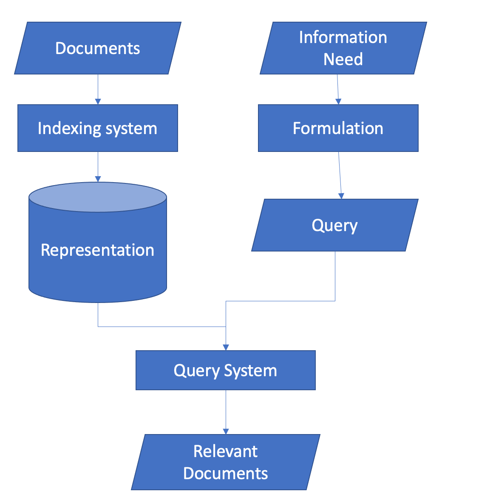

"Information retrieval is a field concerned with the structure, analysis, organisation, storage, searching, and retrieval of information" (Gerard Salton). Information retrieval has many use cases, namely <a href="https://www.techtarget.com/whatis/definition/search-engine">search engines</a>, <a href="https://www.techtarget.com/searchcustomerexperience/definition/chatbot">chatbots</a>, <a href="https://towardsdatascience.com/recommendation-systems-a-review-d4592b6caf4b">recommender systems</a>, documents summarisation and more. The most popular use case is search engine, where the user writes a query and receives as an answer a list of documents ranked by relevance. In this blog, we will go through the components of information retrieval, the metrics that can be used to measure the performance of the information retrieval program and finally we will go through a python implementation and a real life example. Prior to writing this blog, I have read and was heavily influenced by <a href="https://nlp.stanford.edu/IR-book/pdf/irbookonlinereading.pdf">An Introduction to Information Retrieval</a> and  <a href="https://ciir.cs.umass.edu/downloads/SEIRiP.pdf">Search engines</a>, Information Retrieval in Practice, many of the definitions come directly from the former book. They are both great books and I would suggest the reader to look into them to get a deeper understanding of the topic of information retrieval. 

## Information retrieval components
The information retrieval programs consist of two components. The first component is the indexing system, where the program stores the data in an efficient way so that it can retrieve the documents quickly. The second component is the query system where it uses the user's query and retrieves the documents that are the most relevant according to the query (Mario Pérez-Montoro, Lluís Codina, in Navigation Design and SEO for Content-Intensive Websites). 



### Indexing system

## Integrating Azure Entra ID (Azure AD) with Spring Boot
Spring Boot provides integration with Azure Entra ID through [**Spring Cloud Azure**](https://learn.microsoft.com/en-us/azure/developer/java/spring-framework/configure-spring-boot-starter-java-app-with-azure-active-directory). By configuring Azure AD properties and dependencies in your Spring Boot application, you can enable OAuth2-based authentication with Azure AD. This integration simplifies the authentication process and provides seamless access to Azure resources. Here is how you can achieve this:

`pom.xml`: Add these dependencies to your maven project.
```xml
	<dependencyManagement>
		<dependencies>
			<dependency>
				<groupId>com.azure.spring</groupId>
				<artifactId>spring-cloud-azure-dependencies</artifactId>
				<version>${spring-cloud-azure.version}</version>
				<type>pom</type>
				<scope>import</scope>
			</dependency>
		</dependencies>
	</dependencyManagement>
	<dependencies>
		<dependency>
			<groupId>org.springframework.boot</groupId>
			<artifactId>spring-boot-starter-web</artifactId>
		</dependency>
		<dependency>
			<groupId>org.springframework.boot</groupId>
			<artifactId>spring-boot-starter-security</artifactId>
		</dependency>
		<dependency>
			<groupId>com.azure.spring</groupId>
			<artifactId>spring-cloud-azure-starter-active-directory</artifactId>
		</dependency>
		<!-- Required for acting as a web application -->
		<dependency>
			<groupId>org.springframework.boot</groupId>
			<artifactId>spring-boot-starter-oauth2-client</artifactId>
		</dependency>
		<!-- Required for acting as a resource server -->
		<dependency>
			<groupId>org.springframework.boot</groupId>
			<artifactId>spring-boot-starter-oauth2-resource-server</artifactId>
		</dependency>
	</dependencies>
```

`application.yml`: Add these properties to your spring boot application.
```yml 
spring:
  cloud:
    azure:
      active-directory:
        enabled: true
        profile:
          tenant-id: <your-tenant-id>
        credential:
          client-id: <your-client-id>
          client-secret: <your-client-secret>
        # Use any option fits your requirements
        application-type: web-application OR web-application-and-resource-server OR ...
```


`SecurityConfig.java`: This class implements the Azure AD integration with Spring Boot. Feel free to extend it even further, also based on `@Profile`s for local testing.
```java
@Configuration
@EnableWebSecurity
@EnableMethodSecurity
public class SecurityConfig {

    @Bean
    SecurityFilterChain filterChain(HttpSecurity http, ExpiredTokenFilter expiredTokenFilter) throws Exception {
        return http
                .authorizeHttpRequests(auth -> auth.anyRequest().authenticated())
                // act as a web app (login users, id tokens, ...)
                .with(AadWebApplicationHttpSecurityConfigurer.aadWebApplication(), Customizer.withDefaults())
                // act as a resource server (client credentials auth, access tokens, ...)
                .with(AadResourceServerHttpSecurityConfigurer.aadResourceServer(), Customizer.withDefaults())
                // Read the next section about this!
                .addFilterBefore(expiredTokenFilter, OAuth2AuthorizationRequestRedirectFilter.class)
                .build();
    }
}
```

## Implementing the Token Refresh Filter
To enhance token management, we'll implement the token refresh logic using a Servlet Filter. The filter intercepts incoming requests and triggers token refresh if necessary via re-authenticating. We'll leverage Spring Security's `OAuth2AuthorizedClientManager` to achieve this. For more details, check `RefreshTokenOauth2AuthorizedClientProvider`.

`ExpiredTokenFilter.java`: This is configured in the next step.
```java
@Component
@RequiredArgsConstructor // if you don't know what this is, shame on you! It's Lombok
public class ExpiredTokenFilter extends OncePerRequestFilter {

    private final OAuth2AuthorizedClientManager oAuth2AuthorizedClientManager;

    public ExpiredTokenFilter(OAuth2AuthorizedClientManager oAuth2AuthorizedClientManager) {
        this.oAuth2AuthorizedClientManager = oAuth2AuthorizedClientManager;
    }

    @Override
    protected void doFilterInternal(HttpServletRequest request, HttpServletResponse response, FilterChain filterChain) throws ServletException, IOException {
        Authentication authentication = SecurityContextHolder.getContext().getAuthentication();
        if (authentication instanceof OAuth2AuthenticationToken token) {
            validateToken(token, request, response);
        }
        filterChain.doFilter(request, response);
    }

    private void validateToken(OAuth2AuthenticationToken token, HttpServletRequest request, HttpServletResponse response) {
        OAuth2AuthorizeRequest authRequest = OAuth2AuthorizeRequest
                .withClientRegistrationId(token.getAuthorizedClientRegistrationId())
                .principal(token)
                .attributes(attrs -> {
                    attrs.put(HttpServletRequest.class.getName(), request);
                    attrs.put(HttpServletResponse.class.getName(), response);
                }).build();
        // Will trigger the refresh if the token has expired. See RefreshTokenOauth2AuthorizedClientProvider.authorize
        oAuth2AuthorizedClientManager.authorize(authRequest);
    }
}
```

By configuring the filter chain order, we'll ensure that our custom token refresh filter executes before the `OAuth2AuthorizationRequestRedirectFilter`. This ensures that token refresh logic is applied early in the request processing flow, allowing seamless token management without affecting the authentication flow.

`SecurityConfig.java`: See before for the complete example.
```java
    ...
    .addFilterBefore(expiredTokenFilter, OAuth2AuthorizationRequestRedirectFilter.class)
```

## Conclusion
Efficient token management is crucial for ensuring secure and seamless authentication in Spring Boot applications. By integrating Spring Cloud Azure and implementing custom token refresh logic with filters, developers can enhance token management capabilities, improve user experience, and bolster application security. Implementing such practices not only ensures smooth operation but also demonstrates a commitment to best practices in authentication and security.