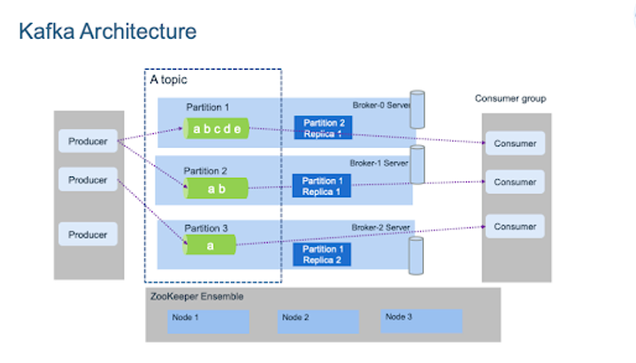

<a href="https://kafka.apache.org/">Apache Kafka</a>
 is an open-source distributed event streaming platform used by <a href="https://kafka.apache.org/powered-by">thousands of companies</a> for high-performance data pipelines, streaming analytics, data integration, and mission-critical applications.


Some of the benefits are:

* **Scalability**: Kafka is designed to handle large-scale, high-throughput, real-time data processing.

* **Real-time processing**: Kafka enables real-time data processing by providing low latency and high throughput.

* **Reliability**: Kafka is designed to be highly reliable, with features such as replication, partitioning, and fault tolerance.

Some of the real-life use cases for Kafka are <a href="https://www.gartner.com/en/information-technology/glossary/clickstream-analysis#:~:text=A%20form%20of%20Web%20analytics,monitor%20and%20measure%20website%20activity">clickstream analysis</a>, credit card fraud detection, <a href="https://www.oracle.com/internet-of-things/what-is-iot/#:~:text=What%20is%20IoT%3F,and%20systems%20over%20the%20internet">internet of things</a>. Overall, Kafka is a great platform to use if you need to have real-time data processing. 

# Components
The high level architecture of Kafka is illustrated below. It may look a bit confusing, we will decompose it and hopefully it will be clear after this section.



* **Producer**: a client that sends (publishes/produces) messages or data to Kafka.

* **Consumer**: a client that reads (subscribes/consumes) messages or data from Kafka.

* **Broker**: a server that acts as a message broker. It receives messages from the producer and stores them in the topic partitions (think of a topic like a group of queues for now). It is also responsible for replicating the data across multiple brokers for fault-tolerance and scalability.

    * Note: in order to have multiple brokers, network latency needs to be very low (<15ms).

* **Topic**: category or stream name to which the producer publishes messages and the consumer subscribes to messages. Each topic is divided into partitions, and each partition can be replicated across multiple brokers for high availability and scalability. Think about it like a folder in a filesystem, and you have many workers (producers and consumers) which read and write data from there.

* **Partition**: unit of parallelism in Kafka that stores a subset of messages in a topic.

* **Consumer group**: A consumer group is a group of consumers that work together to consume messages from a topic. Each consumer in the group subscribes toa unique subset of partitions in the topic, allowing for parallel processing of messages.

* **Zookeeper**: manage and coordinate the brokers and consumers in the cluster. It also provides a centralized infrastructure for maintaining configuration information, naming, synchronization, and group services. In particular it is responsible for the following activities:

    * **cluster coordination**: manage the Kafka cluster, including keeping track of the status of the brokers, topics, and partitions. It makes sure the cluster is in consistent state and provides unified view to the brokers and consumers.

    * **Configuration management**: manage the configuration information of the brokers and consumers. When a new broker registers to Zookeeper and it retrieves the configurations again from Zookeeper.

    * **Leader election**: if a partition leader (the partition consumer reads the messages from) fails, zookeeper is responsible for finding the new leader.

    * **Group membership:** Zookeeper keeps track of which consumers are member of which group. This allows Kafka to balance the load among the consumers and ensure that each message is processed exactly once.


# Kafka implementation (on premise)

We will go through the steps you need in order to have Kafka up and running into your own server. Before starting, you should have Apache Kafka installed into your machine. In case you don't, please follow the following walk-throughs for <a href="https://hevodata.com/blog/how-to-install-kafka-on-ubuntu/">ubuntu</a> and <a href="https://www.conduktor.io/kafka/how-to-install-apache-kafka-on-mac-with-homebrew/">mac</a>.

After having Kafka in your machine, you follow the following steps in order to get started: 

1. Start Kafka: `sudo systemctl start kafka`
2. Check Kafka status (it should be active): `sudo systemctl status kafka`
3. Start Zookeeper: `sudo systemctl enable zookeeper`
4. Enable Kafka: `sudo systemctl enable kafka`


## Python implementation
### Producer
We should create first the producer which will be publishing messages to the topic.

```python
from kafka import KafkaProducer

# Create a Kafka producer instance
producer = KafkaProducer(
    bootstrap_servers=['localhost:9092'], # list of brokers
    value_serializer=lambda x: x.encode('utf-8') # Convert data to bytes
)

# Send a message to a topic
producer.send(
            # topic you will be publishing
            topic='test-group', 
            # you can find the list of partitions 
            # producer.partitions_for('test-topic')
            # Partition you will be publishing
            partition=0,
            # must be bytes or serializable to bites
            value='Hello, Kafka!' 
            )

# Make all buffered records available to be published
producer.flush()
Consumer
We will create one consumer which will be subscribing to the topic we publish to with Producer.

from kafka import KafkaConsumer

# Create a Kafka consumer instance
consumer = KafkaConsumer(
    'test-topic',
    # list of brokers
    bootstrap_servers=['localhost:9092'],
    # Start from the earliest message in the topic
    auto_offset_reset='earliest',
    # The id of the group consumer belongs to
    group_id='test-group',
    # Convert bytes to data
    value_deserializer=lambda x: x.decode('utf-8'))

# Read messages from the topic
for message in consumer:
    print(message.value)
```

## Go implementation
### Producer
We should create first the producer which will be publishing messages to the topic.

```go
package main

import (
    "fmt"
    "log"

    "github.com/Shopify/sarama"
)

func main() {
    config := sarama.NewConfig()
    config.Producer.Return.Successes = true

    producer, err := sarama.NewSyncProducer(
        []string{"localhost:9092"}, // Arrays of brokers
        config,
    )
    if err != nil {
        log.Fatalf("Failed to start producer: %s", err)
    }
    // make sure you close the producer
    defer func() {
        if err := producer.Close(); err != nil {
            log.Fatalf("Failed to close producer cleanly: %s", err)
        }
    }()

    topic := "test-group"
    msg := &sarama.ProducerMessage{
        Topic: topic,                                 // Topic name
        Value: sarama.StringEncoder("Hello, Kafka!"), // message content
    }

    partition, offset, err := producer.SendMessage(msg)
    if err != nil {
        log.Fatalf("Failed to send message to Kafka: %s", err)
    }

    fmt.Printf("Message sent to partition %d at offset %d\n",
        partition,
        offset)
}

```

### Consumer

```go
package main

import (
    "fmt"
    "log"

    "github.com/Shopify/sarama"
)

func main() {
    config := sarama.NewConfig()
    config.Consumer.Return.Errors = true

    consumer, err := sarama.NewConsumer([]string{"localhost:9092"}, config)
    if err != nil {
        log.Fatalf("Failed to start consumer: %s", err)
    }
    // make sure you close the consumer
    defer func() {
        if err := consumer.Close(); err != nil {
            log.Fatalf("Failed to close consumer cleanly: %s", err)
        }
    }()

    topic := "test-group"
    partition := int32(0)
    // Start from the earliest message in the topic
    offset := sarama.OffsetNewest 

    partitionConsumer, err := consumer.ConsumePartition(topic, partition, offset)
    if err != nil {
        log.Fatalf("Failed to start partition consumer: %s", err)
    }
    defer func() {
        if err := partitionConsumer.Close(); err != nil {
            log.Fatalf("Failed to close partition consumer cleanly: %s", err)
        }
    }()

    for {
        select {
        case msg := <-partitionConsumer.Messages():
            fmt.Printf("Received message: %s\n", msg.Value)
        case err := <-partitionConsumer.Errors():
            log.Fatalf("Error consuming message: %s", err)
        }
    }
}
```