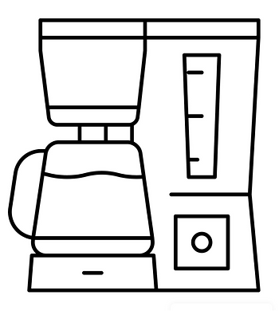
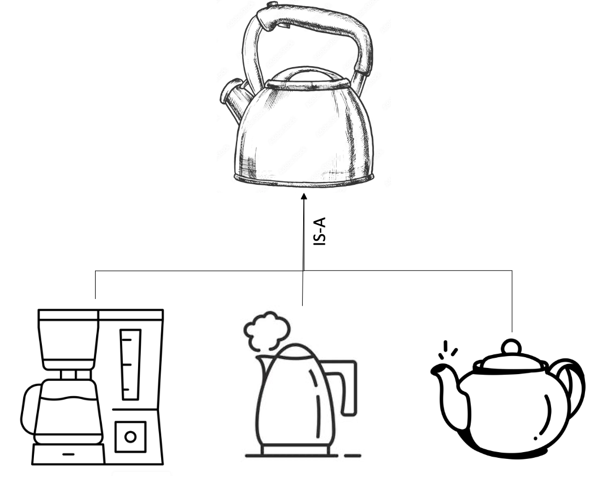
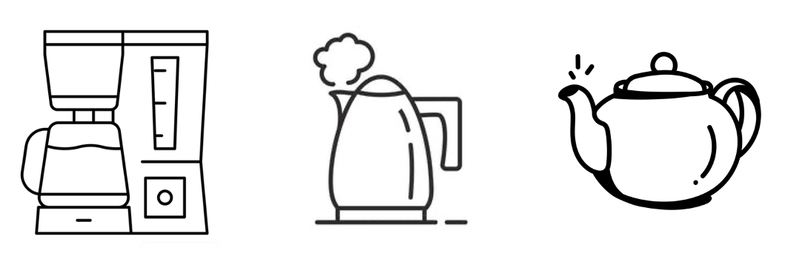

<a href="https://en.wikipedia.org/wiki/Alan_Kay">Alan Kay</a>

Object-oriented programming (OOP) is a programming style that makes code easier to understand, reuse, and maintain. It was inspired by the way cells communicate with each other and was coined by <a href="https://en.wikipedia.org/wiki/Alan_Kay">Alan Kay</a> in the 1970s. 

OOP is a powerful paradigm that can be used to develop a wide variety of software applications. It is important to note that OOP is not a silver bullet, and it is not the best solution for every problem. However, it can be a valuable tool for programmers who want to write code that is more modular, reusable, and maintainable. This blog post will examine the advantages, and potential pitfalls of OOP while illustrating how can someone use it to create predictive models.

# Core principles

Object oriented programming has four main principles

## Abstraction

Abstraction is the process of hiding the implementation details of an object from the outside world. Think about your coffee machine, you only want to make your coffee by pushing one button, you don't want to know what happens inside the machine.

<div style="text-align:center">
    
</div>


### Pros:

* **Simplicity**: users focus on the object's functionality rather than its implementation;

* **Modularity**: enables developers to break down complex systems into smaller modules, which makes it easier to develop, maintain, test;

* **Maintainability**: it makes it easier to maintain and update a piece of code since you only need to change the internal implementation of the abstraction without affecting the code using it. However, for this one you should consider <a href="https://www.digitalocean.com/community/conceptual-articles/s-o-l-i-d-the-first-five-principles-of-object-oriented-design">SOLID</a> principles because you may end up causing issues;

* **Security**: enables developers hide information from the user (let's say you are a vendor and you want your user only to use the high level methods and not know your methodology details)

Abstraction is very powerful, but it can cause problems if it is not used cautiously.

### Pitfalls:

* **Increased complexity**: abstraction can lead to overly complex code, especially if it is used heavily. This can make it difficult to debug and test the code, imagine if you have to open many modules in order to see what is the functionality of a method;

* **Hidden costs**: abstraction can hide the true cost and time it takes to implement a feature;

### Example

We will go through an example to illustrate abstraction, we will create a class for <a href="https://en.wikipedia.org/wiki/Linear_regression">linear regression</a> where the user can train it with labelled data points and infer predictions based on new data points.

The code for the class will be the following:

```python
import numpy as np

class LinearRegressionModel:
    def __init__(self):
        self.__coefficients = None
        
    def train(self, X, y):
        X_with_bias = np.c_[np.ones((X.shape[0], 1)), X]
        self.__coefficients = np.linalg.inv(X_with_bias.T.dot(X_with_bias)).dot(X_with_bias.T).dot(y)

    def predict(self, X):
        if self.__coefficients is None:
            raise ValueError("Model has not been trained.")
        
        X_with_bias = np.c_[np.ones((X.shape[0], 1)), X]
        predictions = X_with_bias.dot(self.__coefficients)
        return predictions
```

Now the user, in order to train the linear regression with new data points, they only need to run the following code:

```python
X_train = np.array([[1.0], [2.0], [3.0], [4.0], [5.0]]) 
y_train = np.array([2.0, 4.0, 6.0, 8.0, 10.0])

# Create an instance of the LinearRegressionModel 
model = LinearRegressionModel()  
# Train the model 
model.train(X_train, y_train) 
```

In order for the user to run inference based on new data points, they only need to do the following:
```python
X_test = np.array([[2.0], [3.0], [6.0]])
model.predict(X_test)
```
array([ 4.,  6., 12.])

We can see the benefits of abstraction on the example above, the user doesn't need to know the specifics of the train or predict methods in order to utilise them. Moreover, if a developer wants to fix issues in the method train or predict, they don't need to change any other piece of code using those methods.

## Encapsulation

Encapsulation is a programming concept that bundles attributes and methods which operate in those attributes in a single unit. This allow us to hide and protect the internal state of the classes' attributes by managing how they are used and accessed. Think of your coffee machine again, you don't have access (easily) to the mechanics (inside the box) because it is best for you not to mess something up.


<div style="text-align:center">
    
</div>

### Pros:

* **Controlled access**: encapsulation provides a controlled way to modify the internal state of an object, for example if you ask a user to input their date of birth, you would not accept values below the date of birth of the oldest person alive or above today's date.

* **Security**: Encapsulation can help to improve the security of a system by hiding sensitive information from unauthorized users. A famous example of encapsulation failure (many of us had to write patches before Christmas break) is the <a href="https://www.dynatrace.com/news/blog/what-is-log4shell/">Log4j library vulnerability</a>. which allowed attackers to run arbitrary code to servers that were using the Log4j library.

* **Hiding Data**: Encapsulation allows you to hide the internal state (attributes) of an object from external access, which helps protect the integrity of the data.

* **Modularity**: Encapsulation facilitates modularity by encapsulating related data and behaviour within a class. This makes it easier to manage and maintain code because changes to one class have limited impact on other parts of the codebase.

### Pitfalls:


* **Inflexibility**: If the class is too encapsulated, it might be difficult to extend or modify without changing its interface.

* **Excessive complexity**: Over-encapsulation may lead to increased complexity, making the code more difficult to understand and maintain.

* **Excessive use of Getters and Setters**: not all attributes need to be private, using a setter and getter for every attribute can lead to <a href="https://deviq.com/domain-driven-design/anemic-model">anemic objects</a>.

* **Difficulty in debugging**: Debugging becomes harder when you can't easily inspect the internal state of an object.

* **Difficulty in testing**: Unit-testing becomes harder when the internal state of an object is well-hidden.

* **Computational overhead**: Using getters and setters for simple attributes can introduce a performance overhead, as they involve method calls.

### Example

As a predictive model developer you don't want people to manually intervene into the insides of your algorithm, so it makes sense to keep the parameters of the algorithm private. But for interpretability reasons you may want your users to know how your model produces its output, therefore having a getter function could help you. We will illustrate this below:

```python
import numpy as np

class LinearRegressionModel:
    def __init__(self):
        self.__coefficients = None

    def get_coefficients(self):
        return self.__coefficients
        
    def train(self, X, y):
        X_with_bias = np.c_[np.ones((X.shape[0], 1)), X]
        self.__coefficients = np.linalg.inv(X_with_bias.T.dot(X_with_bias)).dot(X_with_bias.T).dot(y)

    def predict(self, X):
        if self.__coefficients is None:
            raise ValueError("Model has not been trained.")
        
        X_with_bias = np.c_[np.ones((X.shape[0], 1)), X]
        predictions = X_with_bias.dot(self.__coefficients)
        return predictions
```

Let's run it, to see how it should look like: 


```python
X_train = np.array([[1.0], [2.0], [3.0], [4.0], [5.0]]) 
y_train = np.array([2.0, 4.0, 6.0, 8.0, 10.0])

# Create an instance of the LinearRegressionModel 
model = LinearRegressionModel()  
# Train the model 
model.train(X_train, y_train) 
# Get coefficients
model.get_coefficients()
```
array([5.32907052e-15, 2.00000000e+00])

You can see that by using a getter function you can control what the user can see. In case you want for the user to be able to make (controlled) changes at the state of the object, you can use a setter function. For example, if you want to build an application which takes as input weight, you shouldn't accept negative values.

## Inheritance

>Inheritance refers to the assets that an individual bequeaths to their loved ones after they pass away.

In OOP, inheritance is a way for a class to inherit the characteristics (attributes) and behaviours (methods) of another class. You can create a new class using an existing class, and then you can modify its own unique features. Just like your coffee machine that is a water processing machine which has common attributes and behaviours with other water processing machines such as a kettle or a tea maker.

<div style="text-align:center">
    
</div>


### Pros

* **Reusability**: Inheritance enables you to reuse code from the parent (base) class in one or more child (derived) classes.

* **Modularity and Maintenance**: Inheritance hierarchies aid in structuring and organizing your code, enhancing its modularity and maintainability. They achieve this by grouping shared attributes and behaviours in higher-level classes and defining specialized behaviours in lower-level classes. 

* **Conceptual clarity**: Inheritance models have "IS-A" relationships, which can provide a clear way to represent relationships among classes. A derived object IS A parent object (coffee machine IS A water processing machine).

### Pitfalls

* **Tight coupling**: Inheritance creates a tight coupling between parent and child classes, changes in parent class can affect the behaviour of the child classes.

* **Overuse**: Overusing inheritance can lead to deep and complex hierarchies making the code harder to understand and maintain, aka <a href="https://www.educative.io/answers/what-is-a-diamond-problem-in-object-oriented-programming">diamond problem</a>.

* **Inappropriate subclassing**: creating an inheritance may not be semantically correct, which can lead to incorrect modeling and therefore understanding. 

* **Difficulty in testing**: it can be challenging to test behaviours of derived classes.

### Example

Assume you want to limit the predictions of the linear regression to a specific value (prediction thresholding). For this scenario, we will create a subclass from the linear regression model where we apply a prediction thresholding. 


```python
import numpy as np

class LinearRegressionModel:
    def __init__(self):
        self.__coefficients = None

    def get_coefficients(self):
        return self.__coefficients
        
    def train(self, X, y):
        X_with_bias = np.c_[np.ones((X.shape[0], 1)), X]
        self.__coefficients = np.linalg.inv(X_with_bias.T.dot(X_with_bias)).dot(X_with_bias.T).dot(y)

    def predict(self, X):
        if self.__coefficients is None:
            raise ValueError("Model has not been trained.")
        
        X_with_bias = np.c_[np.ones((X.shape[0], 1)), X]
        predictions = X_with_bias.dot(self.__coefficients)
        return predictions
    
class CustomLinearRegression(LinearRegressionModel):
    def __init__(self, threshold):
        super().__init__()
        self.threshold = threshold

    def predict(self, X):
        predictions = super().predict(X)
        predictions = np.where(predictions > self.threshold, self.threshold, predictions)
        return predictions
```

We can see that derived class has all the behaviours and attributes of the base class.

```python
X_train = np.array([[1.0], [2.0], [3.0], [4.0], [5.0]]) 
y_train = np.array([2.0, 4.0, 6.0, 8.0, 10.0])

# Create an instance of the CustomLinearRegression 
model = CustomLinearRegression(threshold=8.0)  
# Train the model 
model.train(X_train, y_train) 
# Get coefficients
model.get_coefficients()
```
array([5.66213743e-15, 2.00000000e+00])

```python
X_test = np.array([[2.0], [3.0], [6.0]]) 
model.predict(X_test)
```

array([4., 6., 8.])

We can see that we use the predict class but the threshold is applied. The third record ([6.0]) would have a value of 12.0, but the thresholding feature sets it to 8.0.

## Polymorphism

The term "polymorphism" has its roots in the Greek language, specifically in the Greek words "poly" (many) and "morph" (form / shape). This core principle refers to the ability of subclasses to have many different forms while having the same base class. Polymorphism can  be achieved with method overriding and method overloading. Just like your coffee machine which is a water processing machine, but it is used to make coffee and it is different from a kettle and a tea maker which are also water processing machines.

<div style="text-align:center">
    
</div>

### Method Overriding

Method overriding refers to the way of changing the implementation of a method, defined by the base class, in the subclass while keeping the same method signature (name, parameters, return type) 

### Method Overloading

Method overloading refers to the ability of having many methods with the same name but different set of parameters.

### Pros

Simplified Code: Polymorphism simplifies code by allowing you to write general-purpose methods that operate on objects of a base class.

Code Flexibility: Polymorphism allows for greater flexibility in code design. This promotes a cleaner and more modular code structure.

### Pitfalls

Lack of Clarity: When dealing with polymorphism, it may not always be immediately clear which implementation of a method is being invoked.

### Example

#### Overriding

An example of overriding we showed before at the inheritance section, where we override the predict method.

```python
def predict(self, X):
        predictions = super().predict(X)
        predictions = np.where(predictions > self.max_value, self.max_value, predictions)
        return predictions
```
In this scenario we use the prediction method from the parent class, but that is not necessary. We can override the method without any reference to the inherited implementation.

#### Overloading

We will illustrate overloading of the predict method. We will implement the same functionality as the overriding experiment, but using the overloading method.

```python
class CustomLinearRegression(LinearRegressionModel):
    def __init__(self):
        super().__init__()

    def predict(self, X, threshold=None):
        
        predictions = super().predict(X)
        if isinstance(threshold, float):
            predictions = np.where(predictions > threshold, threshold, predictions)
        return predictions
```

Let's train the CustomLinearRegression class.

```python
X_train = np.array([[1.0], [2.0], [3.0], [4.0], [5.0]]) 
y_train = np.array([2.0, 4.0, 6.0, 8.0, 10.0])

# Create an instance of the CustomLinearRegression 
model = CustomLinearRegression()  
# Train the model 
model.train(X_train, y_train) 
# Get coefficients
model.get_coefficients()
```

Let's try to predict the output without any threshold

```python
X_test = np.array([[2.0], [3.0], [6.0]]) 
model.predict(X_test)
```
array([ 4.,  6., 12.])

We see, that the prediction is as the expected one from the linear regression model.

And now, let's try to predict the output with the threshold:

```python
model.predict(X_test, threshold=8.0)
```
array([4., 6., 8.])

We see that the prediction is capped by the upper bound threshold.

For the given scenario, even though we can implement them with both methods it would be a better option to implement it with overloading.

But why should you avoid overriding? There are two reasons (of which I can think of) that you should avoid it.

1. You eliminate the ability to predict without an upper bound threshold. 

2. You only construct (initialize) the object once. If the user needs to conduct many predictions with different thresholds, they don't need to construct the class many times to change the threshold but they just change the value of the threshold at the prediction method.

It is important to know that python doesn't support overloading like other strongly-typed languages do, and our example is a workaround of overloading.

## Additional principles

Beyond the core principles there are some more principles in OOP that may not be used as often but they can be very useful if you have the right scenario.

### Association

Association is the relationship between one object's functionality and another's. Association of two objects is not the same thing as inheritance. Association signifies that one object utilizes the functionalities or methods of another object, rather than the hierarchical relationship seen in class inheritance. There are two types of association, composition and aggregation. But before we go through it, it could be beneficial to enumerate the differences between inheritance and association to clarify the concepts.


#### Differences

1. Association happens between two **different** objects, while inheritance happens between two similar objects.

2. Association has a **HAS-A** relationship, while inheritance has a **IS-A** inheritance. For example, a coffee machine  HAS A water tank.

### Composition

Composition is a type of Association of which the existence of an object (composite) is tightly bound to the existence of another object (component). For example, you cannot have a coffee machine (composite) without a water tank (component), in this scenario, there is a HAS-A relationship between the coffee machine and the water tank. 

#### Pros

* **Encapsulation**: It allows for encapsulation since the internal details of the composite object can be hidden from the outside world.

#### Pitfalls

* **Rigidity**: The strong relationship can make the system less flexible. It becomes harder to change the structure of the composite class.

#### Example

We will create a predictive analytics pipeline to illustrate how to use composition in the context of predictive analytics.

We will first create a data processing class, which standardizes the data, then we will use the customized linear regression model to conduct the predictions.


For scaling the data we will use the <a href="https://en.wikipedia.org/wiki/Standard_score">standard scaling</a>.


```python
class StandardScaler:
    def __init__(self):
        self.mean_ = None
        self.std_ = None

    def fit(self, X):
        self.mean_ = np.mean(X)
        self.std_ = np.std(X)
        return self

    def transform(self, X):
        if self.mean_ is None or self.std_ is None:
            raise ValueError("Scaler not fitted. Call fit() before transforming data.")

        X_scaled = (X - self.mean_) / self.std_
        return X_scaled

    def fit_transform(self, X):
        self.fit(X)
        return self.transform(X)
```

Then, we will create the predictive pipeline. The composite class is *PredictivePipeline* and the component classes are *StandardScaler* and *CustomLinearRegression*.


```python
class PredictivePipeline(StandardScaler, CustomLinearRegression):
    def __init__(self):
        super().__init__()

    def train(self, X, y):
        X_transformed = self.fit_transform(X)
        super().train(X_transformed, y)

    def predict(self, X, threshold=None):
        X_transformed = self.transform(X)
        return super().predict(X_transformed, threshold=threshold)
```

Below you can see that *PredictivePipeline* has the behaviours of both *StandardScaler* and *CustomLinearRegression*.

```python
X_train = np.array([[1.0], [2.0], [3.0], [4.0], [5.0]]) 
y_train = np.array([2.0, 4.0, 6.0, 8.0, 10.0])

# Create an instance of the CustomLinearRegression 
pipeline = PredictivePipeline()  
# Train the model 
pipeline.train(X_train, y_train) 
pipeline.get_coefficients()
```
array([6.        , 2.82842712])

```python
X_test = np.array([[2.0], [3.0], [6.0]]) 
pipeline.predict(X_test)
```
array([ 4.,  6., 12.])

```python
pipeline.predict(X_test, threshold=8.0)
```
array([4., 6., 8.])


### Aggregation

Aggregation is a type of Association of which the existence of an object (aggregator) is not tightly bound to the existence of another object (aggregated). For example, you can have a coffee machine without water in the water tank, again the relationship between coffee machine and water would be HAS-A relationship.

#### Pros

* **Flexibility**: Aggregation is more flexible to composition. Even though it does imply relationship, the objects can exist independently.

* **Reusability**: Classes involved in aggregation can be used for different context.

#### Pitfalls

* **Dependencies**: Even though it is more flexible than composition, aggregated classes can have an impact on the aggregator so code amendments could happen if aggregated classes change.

#### Example

We will extend the example we used for composition. Aggregation is more loose than composition, so we can have some agregatted classes which are not linked to the existence of the object. For our example of PredictivePipeline, we will add a <a href="https://docs.python.org/3/library/dataclasses.html">dataclass</a> for the data we have used to train and evaluate the model. 


```python
from dataclasses import dataclass

@dataclass
class DataLoader:
    x_train = np.array([[1.0], [2.0], [3.0], [4.0], [5.0]])
    y_train = np.array([2.0, 4.0, 6.0, 8.0, 10.0])
    x_test = np.array([[2.0], [3.0], [6.0]])
    y_test = np.array([4., 6., 10.])
```


We need to do some amendments to the PredictivePipeline class. First, we will add the data attribute where we store the training and test data. Then we will create an evaluate method to measure the performance of the linear regression using <a href="https://en.wikipedia.org/wiki/Mean_squared_error">MSE</a>. Finally, we will remove the X, and y arguments from the train method since the training data are part of the class.

```python
class PredictiveModel(StandardScaler, CustomLinearRegression):
    def __init__(self, data=None):
        super().__init__()
        self.data = data

    def train(self):
        if self.data is None:
            raise ValueError("You don't have data, you cannot train a model without data.")
        X_transformed = self.fit_transform(self.data.x_train)
        super().train(X_transformed, self.data.y_train)

    def predict(self, X, threshold=None):
        if self.data is None:
            raise ValueError("You don't have data, you cannot train a model without data.")
        X_transformed = self.transform(X)
        return super().predict(X_transformed, threshold=threshold)
    
    def evaluate(self, threshold=None):
        
        y_pred = self.predict(self.data.x_test, threshold)
        mse = (((self.data.y_test-y_pred)**2).sum())/len(self.data.y_test)
        return mse
```

Let's train the new pipeline. 

```python
model = PredictiveModel(data=DataLoader())  
model.train()
```

Now we can evaluate the model, not using a threshold: 

```python
model.evaluate()
```
1.3333333333333333

Now let's apply the threshold to see if we can perform better.

```python
model.evaluate(threshold=10.0)
```

6.573840876841765e-32

Looks like the model performs better (as if it was planned). 

Note that we haven't linked the predict method to the training data, because we usually run inference on different serve sets.

```python
model.predict(model.data.x_test)
```
array([ 4.,  6., 12.])

And in case we want to apply a threshold (since the model performs better with a threshold of 10.0)

```python
model.predict(model.data.x_test, 10.0)
```
array([ 4.,  6., 10.])


# Conclusion

Object oriented programming provides a robust framework to structure predictive analytics projects offering benefits like code reusability, modularity, maintainability and organization. Class-based encapsulation fosters seamless collaboration among teams by abstracting component mechanics. Team members engage solely with the expected inputs and outputs of utilized components, relieving them from needing intricate knowledge of internal workings. For example, if the data engineering team collaborates with the data science team the data science doesn't need how the <a href="https://en.wikipedia.org/wiki/Extract,_transform,_load">ETL</a> works but they know it loads the data from the various data sources.

However, while OOP offers multiple advantages it is easy to fall into pitfalls which would create technical debt in your project. If you create complex hierarchies, it would make the project difficult to understand and maintain. Also, creating tight couplings between classes it can make it very difficult to write more features on top of the current project.

You should be very critical when you design the code using OOP principles, being judicious is key. Aim for a clear and intuitive class structure that encapsulates responsibilities, promotes code reuse, and maintains flexibility. Making a <a href="https://en.wikipedia.org/wiki/Unified_Modeling_Language">UML</a> diagram can help you striking the right balance between code simplicity and code flexibility. Finally SOLID principles can really help you apply OOP the right way.
